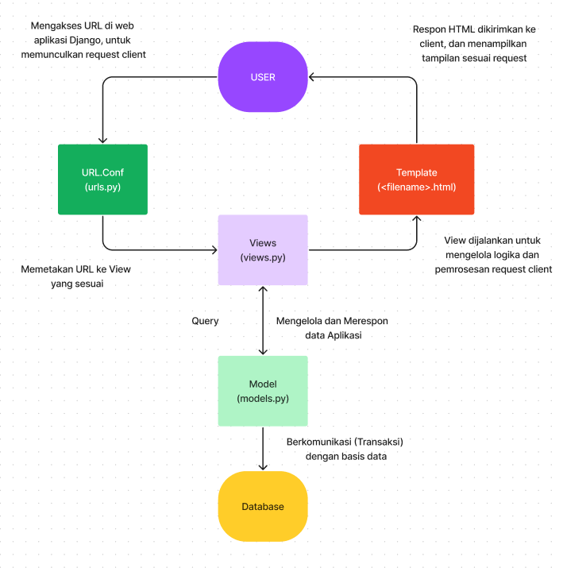
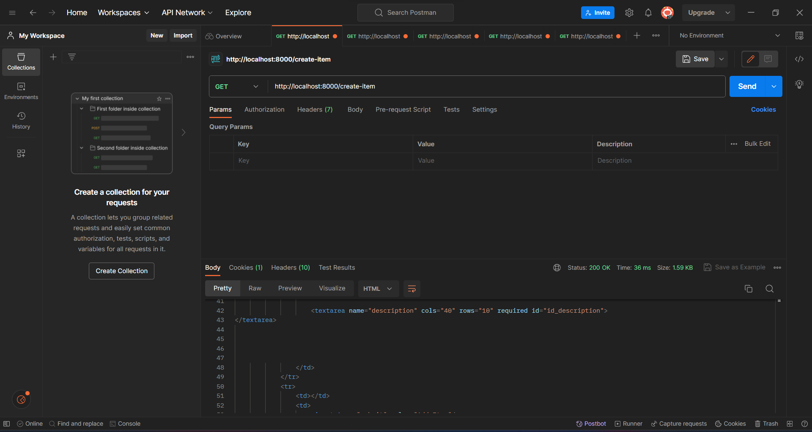
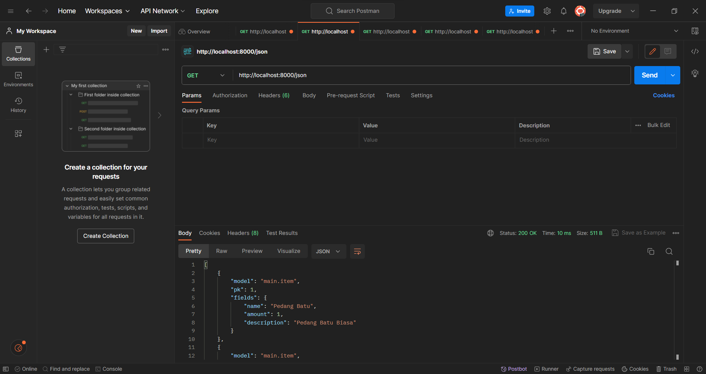
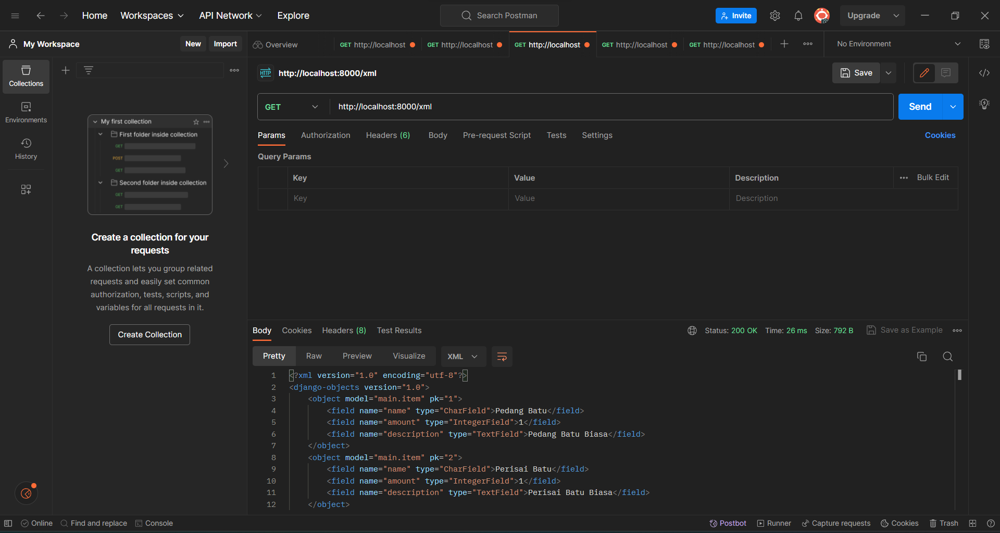
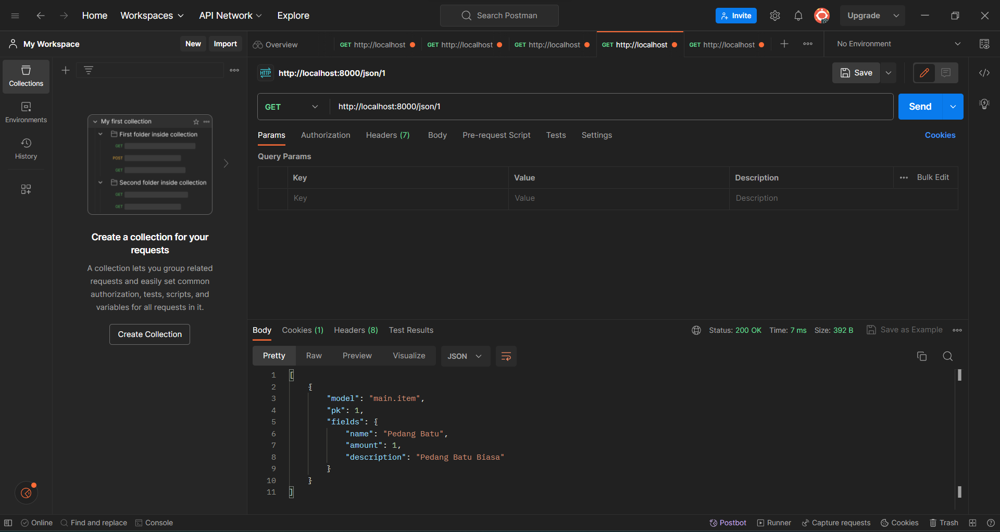
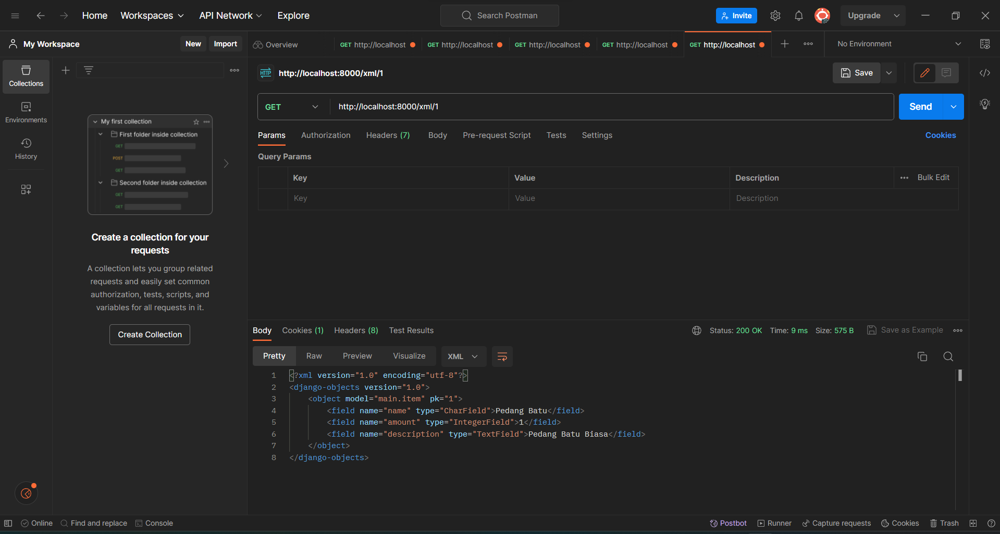

# README

## Nama    : Resanda Dezca Asyam

## NPM     : 2206082682

## Kelas   : PBP C

Link Web : http://resanda-dezca-tugas.pbp.cs.ui.ac.id

Soal Tugas 2

Penjelasan Dari Soal-Soal:
1. Jelaskan bagaimana cara kamu mengimplementasikan checklist di atas secara step-by-step (bukan hanya sekadar mengikuti tutorial).

    **a.  Membuat sebuah project Django awal**

        Saya memulai proyek pengelolaan inventori game pada karakter LightReborn dengan langkah-langkah yang terstruktur. Pertama-tama, 
        saya memulai dengan menginisiasi repositori baru menggunakan perintah "git init" Ini secara otomatis membuat repositori Git 
        kosong di dalam direktori yang sebelumnya telah saya buat, yaitu "resa_lightreborn." Langkah berikutnya adalah menginisiasi 
        repositori di GitHub untuk memulai pelacakan perubahan proyek "resa_lightreborn" secara daring. Setelah itu, saya menghubungkan 
        repositori lokal dengan repositori di GitHub, memastikan bahwa semua perubahan dapat disimpan secara online.

        Langkah selanjutnya adalah menginstalasi Django dan menginisiasi proyek Django. Untuk menjaga lingkungan yang terisolasi, saya    
        mengaktifkan Virtual Environment di dalam direktori "resa_lightreborn." Setelah itu, saya menyiapkan semua dependensi yang 
        diperlukan dan membuat proyek Django. Selanjutnya, saya melakukan konfigurasi proyek dengan mengizinkan akses dari semua host, 
        memastikan bahwa aplikasi dapat diakses secara luas. Untuk memverifikasi apakah proyek Django berhasil dibuat, saya menjalankan 
        server lokal.Terakhir, saya mengunggah proyek "resa_lightreborn" ke repositori GitHub dengan membuat berkas ".gitignore" untuk 
        menentukan berkas-berkas dan direktori-direktori yang harus dikecualikan oleh Git. Setelah itu, saya menjalankan proses "add," 
        "commit," dan "push" dari direktori repositori lokal, sehingga proyek saya dapat terus berkembang.
        
    **b.  Membuat aplikasi bernama main pada project yang telah dibuat** 

        Selanjutnya, saya menjalankan instruksi "python manage.py startapp main" untuk menciptakan direktori baru yang diberi nama 
        "main." Di dalam direktori ini, saya memulai proses pembangunan struktur awal aplikasi, yang akan digunakan untuk menampilkan 
        informasi inventori karakter pada app lightreborn.    

    **c.  Melakukan routing pada proyek agar dapat menjalankan aplikasi main**

        Setelah berhasil membuat aplikasi "main," langkah selanjutnya adalah mendaftarkannya ke dalam proyek Django agar dapat diakses 
        dan digunakan. Tahap ini melibatkan penambahan 'main' ke dalam daftar aplikasi yang telah terdaftar dalam variabel 
        "INSTALLED_APPS" yang ada di berkas "settings.py". Berkas "settings.py" tersebut terletak di dalam direktori proyek 
        "resa_lightreborn". Setelah itu, saya menciptakan sebuah folder bernama template yang berisi "main.html" dalam direktori 
        "templates" yang telah dibuat sebelumnya dalam  aplikasi "main." Template ini memiliki peran krusial dalam tampilan inventori 
        karakter lightreborn. Dalam proses pembuatan "main.html," saya mengisi template tersebut dengan kode HTML yang sederhana, 
        termasuk elemen-elemen seperti judul(application), nama, dan class. Tujuannya adalah untuk memeriksa tampilan dasar halaman HTML 
        yang akan digunakan untuk menampilkan informasi inventori karakter lightreborn.
    
    **d.  Mulai membuat model pada aplikasi main dengan nama Item dan memiliki atribut wajib seperti pada tugas 2**

        Tahap berikutnya dari project Inventori Karakter LightReborn, saya melakukan beberapa perubahan dalam berkas "models.py" yang 
        terletak dalam direktori aplikasi "main." Perubahan ini dimaksudkan untuk mengintroduksi model baru yang diberi nama "Item." 
        Model ini mengandung beberapa bidang, termasuk "name" untuk menyimpan nama item dengan tipe data CharField, "amount" untuk 
        menyimpan jumlah item dengan tipe data IntegerField, dan "description" untuk menyimpan deskripsi item dengan tipe data TextField, 
        yang memungkinkan penyimpanan teks yang lebih panjang. Setelah model "Item" didefinisikan, langkah berikutnya adalah menciptakan 
        dan menerapkan migrasi model. Ini merupakan langkah kunci dalam melacak perubahan pada model basis data.

    **e.  Membuat sebuah fungsi di views.py yang akan menghasilkan output ke dalam sebuah template HTML. Output tersebut akan menampilkan nama aplikasi dan juga nama serta kelas yang dibuat**
 
        Lalu, saya melanjutkan dengan mengintegrasikan komponen MVT (Model-View-Template) dalam kerangka kerja Django. Pertama, saya 
        mengimpor modul yang diperlukan dan membuat sebuah fungsi view yang dinamakan "show_main". Fungsi "render" yang berasal dari 
        modul "django.shortcuts" digunakan untuk merender tampilan HTML dengan data yang diberikan.

        Fungsi "show_main" menerima parameter "request" yang merupakan objek permintaan HTTP dari pengguna. Fungsi ini berperan dalam 
        mengatur permintaan tersebut dan mengembalikan tampilan yang sesuai. Dalam fungsi "show_main," saya menggunakan dictionary 
        "context" untuk mengemas data yang akan disampaikan ke tampilan. Data yang dimasukkan meliputi nama aplikasi, serta nama dan 
        kelas yang relevan dengan proyek.

        Saya menggunakan fungsi "render" dengan tiga argumen: "request" sebagai objek permintaan HTTP, "main.html" sebagai nama berkas 
        template, dan "context" sebagai dictionary yang berisi data untuk membuat tampilan menjadi dinamis. Selama proses ini, saya juga 
        mengubah judul (nama aplikasi), nama, dan kelas yang sebelumnya statis dalam tampilan HTML menjadi kode Django yang memungkinkan 
        nilai-nilainya berasal dari variabel-variabel yang telah didefinisikan dalam "context".

    **f.  Menyiapkan routing dalam berkas "urls.py" aplikasi "main" untuk mengaitkan fungsi yang telah saya buat dalam "views.py".**

        Pertama-tama, saya melakukan konfigurasi routing URL untuk aplikasi "main" dengan membuat berkas baru yang dinamakan "urls.py" di 
        dalam direktori "main". Fungsi dari berkas "urls.py" ini adalah mengatur bagaimana rute URL terkait langsung dengan aplikasi 
        "main" akan ditangani.

        Selanjutnya, saya melanjutkan dengan mengonfigurasi routing URL pada tingkat proyek secara keseluruhan. Ini dilakukan dengan 
        menambahkan rute URL yang akan mengarahkan pengguna ke tampilan yang ada di aplikasi "main." Rute URL ini kemudian dimasukkan ke 
        dalam variabel "urlpatterns" yang terdapat dalam berkas "urls.py" yang berada di dalam direktori proyek "resa_lightreborn."

        Dengan konfigurasi ini, proyek sekarang memiliki mekanisme yang jelas untuk mengarahkan permintaan URL pengguna ke tampilan yang 
        sesuai dalam aplikasi "main."

    **g.  *Unit Testing*, membuat berkas README.md, dan melakukan proses deployment aplikasi yang sudah dibuat agar dapat diakses oleh teman-teman melalui internet.**

        Pertama-tama, saya telah membuat serangkaian unit testing untuk memverifikasi bahwa kode yang telah saya tulis berfungsi sesuai 
        dengan yang diharapkan. Salah satu pengujian adalah "test_main_url_is_exist," yang berfungsi untuk memeriksa apakah alamat URL 
        "/main/" dapat diakses dengan sukses. Pengujian lainnya adalah "test_main_using_main_template," yang bertujuan untuk memastikan 
        bahwa halaman "/main/" dirender dengan benar menggunakan template "main.html." Terakhir, ada pengujian "test_item_model" yang 
        mengonfirmasi kemampuan aplikasi dalam menyimpan dan mengambil data dengan benar dari basis data menggunakan model "Item" yang 
        telah saya definisikan. Semua pengujian ini telah berhasil dilakukan, menunjukkan bahwa kode yang saya tulis berjalan sesuai 
        harapan.

        Langkah terakhir dalam proyek ini adalah memastikan repositori GitHub saya terbarui. Saya telah membuat berkas "README.md" dan 
        melakukan proses "add," "commit," dan "push" ke GitHub. Selanjutnya, saya melakukan proses deployment project "resa_lightreborn" 
        ke platform Adaptable. Saya memilih template "Python App" dengan menggunakan "PostgreSQL" sebagai basis data, serta Python 3.11 
        sebagai lingkungan pelaksanaan. Perintah "python manage.py migrate && gunicorn resa_lightreborn.wsgi" digunakan sebagai perintah 
        awal untuk menjalankan aplikasi. Situs web dapat diakses melalui domain "resalightreborn" dengan menggunakan HTTP Listener yang 
        telah diatur pada PORT. Dengan demikian, proyek saya telah berhasil di-deploy dan siap digunakan secara online.

2. Buatlah bagan yang berisi request client ke web aplikasi berbasis Django beserta responnya dan jelaskan pada bagan tersebut kaitan antara urls.py, views.py, models.py, dan berkas html.

    

3. Jelaskan mengapa kita menggunakan virtual environment? Apakah kita tetap dapat membuat aplikasi web berbasis Django tanpa menggunakan virtual environment?

    Kita menggunakan virtual environment dalam pengembangan aplikasi web berbasis Django karena itu memungkinkan kita untuk menciptakan lingkungan terisolasi yang mengelola dependensi proyek secara efisien. Ini sangat penting karena setiap proyek mungkin memerlukan versi paket Python dan dependensi yang berbeda, sehingga virtual environment membantu menghindari konflik dan masalah kompatibilitas. Tanpa virtual environment, kita dapat membuat aplikasi Django, tetapi akan terbatas dalam pengelolaan dependensi, rentan terhadap konflik, dan lebih sulit untuk menjaga kebersihan sistem. Oleh karena itu, meskipun memungkinkan, sebaiknya kita selalu menggunakan virtual environment dalam pengembangan aplikasi web Django untuk menjaga isolasi dan manajemen dependensi yang efektif.

4. Jelaskan apakah itu MVC, MVT, MVVM dan perbedaan dari ketiganya.

    MVC (Model-View-Controller), MVT (Model-View-Template), dan MVVM (Model-View-ViewModel) adalah pola desain yang digunakan dalam pengembangan perangkat lunak.

    1. MVC: Terdiri dari Model (data dan logika bisnis), View (tampilan yang diberikan kepada pengguna), dan Controller (pengendali alur aplikasi). Controller menghubungkan Model dan View.

    2. MVT: Ini adalah varian dari MVC yang digunakan dalam Django. Model sama, View mengatur logika tampilan, dan Template mengatur tampilan. "Controller" diatur oleh Django secara internal.

    3. MVVM: Digunakan dalam pengembangan aplikasi antarmuka pengguna (UI). Model adalah data dan logika, View menampilkan tampilan, dan ViewModel berperan sebagai perantara. ViewModel mengubah data dari Model agar sesuai dengan tampilan.

    Perbedaannya adalah bagaimana komponen-komponen ini berinteraksi. MVC menggunakan Controller, MVT memiliki tugas Controller internal di Django, sementara MVVM menggunakan ViewModel sebagai perantara. MVC adalah pola desain umum, MVT adalah variasi untuk Django, dan MVVM cocok untuk pengembangan aplikasi UI modern.

Soal Tugas 3

1. Apa perbedaan antara form POST dan form GET dalam Django?

    Perbedaan antara metode form POST dan GET dalam Django, serta dalam pengembangan web secara umum adalah:

    **Form GET:**

    * Pengiriman Data
        * Data dari form dikirimkan sebagai bagian dari URL.
    * Visibilitas Data
        * Data yang dikirimkan dengan metode GET terlihat di URL browser.
    * Keamanan
        * Kurang aman karena data terbuka dan bisa dilihat oleh siapa saja.
    * Pemakaian
        * Biasanya digunakan ketika Anda ingin mendapatkan atau mengakses data tanpa mengubahnya, seperti pencarian atau filter data.
    * Contoh
        * Ketika Anda mencari sesuatu di mesin pencari, kata kunci pencarian ditampilkan di URL sebagai query string.

    **Form POST:**

    * Pengiriman Data
        * Data dari form dikirimkan secara tersembunyi dalam tubuh permintaan HTTP.
    * Visibilitas Data
        * Data tidak terlihat di URL dan lebih aman karena tidak dapat dengan mudah diakses oleh orang lain.
    * Keamanan
        * Lebih aman karena data tersembunyi.
    * Pemakaian
        * Digunakan ketika Anda ingin mengirim data ke server untuk diproses, seperti ketika Anda mengisi formulir pendaftaran atau mengirim komentar ke situs web.
    * Contoh
        * Ketika Anda mengisi formulir pendaftaran online, data yang Anda masukkan (seperti nama, alamat email, dan kata sandi) tidak terlihat di URL.

    Jadi, perbedaan utama antara metode GET dan POST adalah bagaimana data dari formulir disampaikan dan dikelola. GET digunakan untuk mengambil data dari server tanpa mengirim data yang signifikan, sementara POST digunakan untuk mengirim data ke server untuk melakukan tindakan tertentu, seperti menambahkan data ke database atau mengirim pesan. Selain itu, POST lebih aman karena data tidak terlihat di URL, sementara GET memiliki visibilitas data yang lebih tinggi.

2. Apa perbedaan utama antara XML, JSON, dan HTML dalam konteks pengiriman data?

    Perbedaan utama antara XML, JSON, dan HTML dalam konteks pengiriman data adalah:

    **XML (eXtensible Markup Language):**

    * Tujuan Utama
        * Digunakan untuk menyusun dan mentransmisikan data terstruktur antara aplikasi dan platform yang berbeda.
    * Format
        * Teks yang diorganisasi dengan tag yang mendefinisikan struktur data.
    * Kelebihan
        * Fleksibel dan kuat untuk mendefinisikan struktur data yang kompleks.
    * Kekurangan
        * Lebih berat dan rumit daripada format lain seperti JSON.

    **JSON (JavaScript Object Notation):**

    * Tujuan Utama
        * Digunakan untuk pertukaran data antara aplikasi yang sering kali ditulis dalam bahasa pemrograman yang berbeda.
    * Format
        * Teks yang menggambarkan objek dan array dalam bahasa pemrograman.
    * Kelebihan
        * Mudah dibaca oleh manusia dan mudah diolah oleh komputer. Ringan dan efisien.
    * Kekurangan
        * Kurang fleksibel dalam hal mendefinisikan struktur data yang kompleks dibandingkan dengan XML.

    **HTML (HyperText Markup Language):**
    * Tujuan Utama
        * Digunakan untuk merender konten web dalam bentuk yang dapat diinterpretasi oleh peramban web.
    * Format
        * Teks yang diorganisasi dengan tag yang mendefinisikan struktur dan tampilan konten web.
    * Kelebihan
        * Digunakan untuk membuat tampilan dan struktur halaman web. Mendukung tautan hypertext dan media.
    * Kekurangan
        * Terutama digunakan untuk tampilan, bukan pertukaran data terstruktur.

    Jadi, perbedaan utama antara ketiga format ini adalah tujuan penggunaannya. XML dan JSON digunakan untuk pertukaran data terstruktur antara aplikasi, sementara HTML digunakan untuk membuat tampilan dan struktur halaman web. XML cenderung lebih fleksibel tetapi kompleks, JSON ringan dan mudah dibaca, sedangkan HTML digunakan untuk mengatur tampilan konten web.

3. Mengapa JSON sering digunakan dalam pertukaran data antara aplikasi web modern?

    JSON sering digunakan dalam pertukaran data antara aplikasi web modern karena format datanya yang mudah dibaca dan ditulis, ringan, dan mendukung struktur data terstruktur, mirip dengan objek dan array dalam bahasa pemrograman. Hal ini memungkinkan pengembang untuk dengan mudah mengirim, menerima, dan memproses data antar-aplikasi tanpa perlu memikirkan banyak overhead atau kompleksitas. JSON juga mendukung banyak bahasa pemrograman dan diintegrasikan dengan baik dalam lingkungan pengembangan web, membuatnya menjadi pilihan alami untuk berkomunikasi dan berbagi data antar-aplikasi web yang berbeda.

4. Jelaskan bagaimana cara kamu mengimplementasikan checklist di atas secara step-by-step (bukan hanya sekadar mengikuti tutorial).

    1. Membuat input form untuk menambahkan objek model pada app sebelumnya.
        1. Langkah pertama yang saya lakukan adalah menciptakan sebuah template dasar yang bertindak sebagai kerangka umum untuk halaman web dalam proyek ini. Saya menaruh template ini di dalam direktori 'templates' yang terletak di root folder proyek. Setelah itu, saya melakukan penyesuaian pada konfigurasi berkas 'settings.py' yang berada dalam subdirektori 'resa_lightreborn' agar template 'base.html' dapat dikenali sebagai sebuah template. Selanjutnya, dalam subdirektori templates yang ada di dalam direktori 'main', saya melakukan perubahan pada kode berkas 'main.html' agar menggunakan 'base.html' sebagai template utama.
        2. Kemudian, saya membuat sebuah formulir sederhana yang memungkinkan pengguna untuk memasukkan data produk yang akan ditampilkan di halaman utama. Untuk langkah ini, saya menciptakan sebuah berkas baru yang dinamakan 'forms.py' di dalam direktori 'main' untuk merancang struktur formulir. Di dalam 'forms.py', saya melakukan definisi terhadap model yang akan digunakan oleh formulir, yakni 'Item'. Ketika pengguna mengisi formulir dan mengirimkannya, data yang dimasukkan akan disimpan sebagai objek 'Item'. Selain itu, saya juga menentukan field-field yang akan digunakan dalam model 'Item' dalam formulir ini, seperti "name", "amount", dan "description".
        3. Setelah itu, saya melakukan penambahan beberapa impor yang dibutuhkan pada berkas 'views.py' di dalam direktori 'main'. Setelahnya, saya membuat sebuah fungsi baru yang diberi nama 'create_item' dalam berkas tersebut. Fungsi ini menerima parameter 'request' dan berisikan kode yang bertujuan untuk menghasilkan sebuah formulir secara otomatis ketika data dari formulir tersebut di-submit. Di dalam fungsi 'create_item', saya memanfaatkan 'ItemForm' untuk menciptakan sebuah objek formulir yang didasarkan pada data yang diterima dari 'request.POST'. Selanjutnya, saya melakukan validasi terhadap isi input yang dimasukkan ke dalam formulir tersebut dengan menggunakan 'form.is_valid()', dan apabila data yang dimasukkan valid, saya menyimpan informasi dari formulir ke dalam database dengan menggunakan 'form.save()'. Terakhir, setelah data formulir berhasil disimpan, saya mengarahkan pengguna kembali ke halaman utama dengan menggunakan 'HttpResponseRedirect(reverse('main:show_main'))'.
        4. Setelah itu, saya melakukan perubahan pada fungsi 'show_main' yang telah ada dalam berkas 'views.py' dengan menambahkan 'item': item ke dalam dictionary konteks. Untuk mengambil semua objek 'Item' yang telah disimpan dalam database, saya menjalankan perintah 'item = Item.objects.all()'.
        5. Saya menciptakan sebuah berkas HTML yang baru dengan nama 'create_item.html' dan menempatkannya di dalam direktori 'main/templates'. Di dalam berkas ini, saya menggunakan kode berikut:
            * &lt;form method="POST">: Ini digunakan untuk menetapkan blok form dengan menggunakan metode POST.
            * : Ini adalah token keamanan yang selalu di-generate secara otomatis secara berkala oleh Django untuk mencegah dari serangan berbahaya.
            * {{ form.as_table }}: Ini digunakan untuk menampilkan field-field form yang telah didefinisikan dalam 'forms.py' sebagai tabel.
            * &lt;input type="submit" value="Add Item"/>: Ini untuk membuat tombol submit yang akan mengirimkan permintaan ke view 'create_item(request)'.

        6. Terakhir, saya kembali ke halaman 'main.html' dan memasukkan kode ke dalam bagian  dengan tujuan untuk menampilkan data produk dalam format tabel serta menambahkan tombol "Add New Item" yang akan mengalihkan pengguna ke halaman formulir.  
    2. Tambahkan 5 fungsi views untuk melihat objek yang sudah ditambahkan dalam format HTML, XML, JSON, XML by ID, dan JSON by ID.
        1. Pertama-tama, saya membuka berkas views.py dalam direktori 'main'. Di dalamnya, saya menambahkan import untuk HttpResponse dan Serializer.
        2. Setelah itu, saya menciptakan sebuah fungsi baru yang dinamakan show_xml dan menerima parameter request. Dalam fungsi show_xml ini, saya membuat sebuah variabel untuk menyimpan hasil dari kueri data dari seluruh objek yang ada dalam model Item. Kemudian, saya menghasilkan respons HttpResponse dengan mengatur data yang berisi hasil kueri tersebut yang telah di-serialisasi ke dalam format XML, dan menentukan content_type sebagai "application/xml" untuk menandakan bahwa data yang dikirimkan berformat XML.
        3. Setelah itu, saya membuat sebuah fungsi baru yang saya beri nama show_json. Fungsi ini juga menerima parameter request. Dalam implementasinya, saya menjalankan tugas yang serupa dengan fungsi show_xml, yaitu menghasilkan hasil kueri dari seluruh data yang ada dalam model Item. Kemudian, respons HttpResponse dihasilkan dengan mengatur parameter data yang berisi hasil kueri tersebut yang telah di-serialisasi ke dalam format JSON, dan content_type ditetapkan sebagai "application/json" untuk menunjukkan bahwa data yang dikirimkan dalam bentuk JSON.
        4. Terakhir, saya menciptakan dua fungsi baru, yakni show_xml_by_id dan show_json_by_id, yang menerima parameter request dan id. Di dalam kedua fungsi ini, saya melakukan pencarian data dengan ID tertentu dari model Item. Selanjutnya, saya menghasilkan respons HttpResponse dengan menentukan parameter data yang berisi hasil pencarian tersebut yang telah di-serialisasi entah dalam format XML atau JSON, bergantung pada fungsi yang dipanggil. Saya juga menetapkan content_type sesuai dengan format yang diinginkan, yaitu "application/xml" untuk XML atau "application/json" untuk JSON.  
        
    3. Membuat routing URL untuk masing-masing views yang telah ditambahkan pada poin 2.
        1. Langkah pertama saya adalah membuka berkas urls.py yang terletak di direktori 'main'. Di dalam berkas tersebut, saya mengimpor fungsi-fungsi yang telah saya buat sebelumnya di views.py. Kemudian, saya melanjutkan dengan menambahkan beberapa path URL ke dalam variabel urlpatterns. Berikut adalah daftar path URL yang saya tambahkan:
            * path('create-item', create_item, name='create_item'),
            * path('xml/', show_xml, name='show_xml'),
            * path('json/', show_json, name='show_json'),
            * path('xml/&lt;int:id>/', show_xml_by_id, name='show_xml_by_id'),
            * path('json/&lt;int:id>/', show_json_by_id, name='show_json_by_id'), 

5. Mengakses kelima URL di poin 2 menggunakan Postman, membuat screenshot dari hasil akses URL pada Postman, dan menambahkannya ke dalam README.md.

    **Gambar**

    

    

    

    

    

Soal Tugas 4

1. Apa itu Django UserCreationForm, dan jelaskan apa kelebihan dan kekurangannya?

Django UserCreationForm adalah salah satu komponen dari kerangka kerja Django yang digunakan untuk membuat formulir pendaftaran pengguna (user registration form). Ini adalah bagian dari Django's built-in authentication system yang memudahkan pengembang web dalam mengelola sistem otentikasi pengguna.

Kelebihan dari Django UserCreationForm:

 * Kemudahan Penggunaan: Django UserCreationForm dirancang dengan baik dan mudah digunakan. Anda hanya perlu mengimpor modulnya, dan Anda memiliki formulir pendaftaran pengguna yang lengkap.

 * Validasi Otomatis: Formulir ini menyertakan validasi otomatis untuk memastikan bahwa input yang dimasukkan pengguna sesuai dengan aturan yang ditetapkan oleh model pengguna Django. Misalnya, akan memeriksa apakah alamat email adalah format yang benar dan memeriksa keunikan alamat email dalam basis data.

 * Customizable: Meskipun formulir ini telah disediakan dengan fitur-fitur umum yang diperlukan untuk pendaftaran pengguna, Anda masih dapat mengkustomisasinya sesuai kebutuhan proyek Anda. Anda dapat menambahkan atau menghapus bidang-bidang tertentu, atau bahkan menyesuaikan tampilan dan perilaku formulir.

 * Keamanan: Django UserCreationForm mengintegrasikan langkah-langkah keamanan yang penting, seperti hashing password pengguna sebelum menyimpannya ke basis data, sehingga password tidak disimpan dalam teks biasa.

Namun, ada beberapa kekurangan dari Django UserCreationForm:

 * Tidak Secara Default Mendukung Fitur-fitur Lanjutan: Meskipun UserCreationForm mencakup fitur dasar yang diperlukan untuk pendaftaran pengguna, untuk fitur-fitur lanjutan seperti pendaftaran melalui media sosial atau integrasi dengan layanan pihak ketiga, Anda mungkin perlu menambahkan logika tambahan.

 * Tampilan Bawaan Mungkin Tidak Cocok: Tampilan bawaan dari UserCreationForm mungkin tidak sesuai dengan desain dan gaya visual proyek Anda. Anda perlu melakukan penyesuaian tampilan jika Anda ingin agar formulir pendaftaran sesuai dengan tampilan situs web Anda.

 * Harus Dikustomisasi untuk Kasus Penggunaan Khusus: Untuk proyek-proyek dengan kasus penggunaan yang sangat khusus, Anda mungkin perlu menulis formulir pendaftaran kustom dari awal daripada mengandalkan UserCreationForm.

 * Dalam banyak proyek Django, menggunakan UserCreationForm sebagai titik awal yang baik untuk mengelola pendaftaran pengguna karena menyediakan fitur-fitur dasar yang dibutuhkan dengan keamanan bawaan. Namun, Anda harus mempertimbangkan kebutuhan spesifik proyek Anda dan apakah Anda perlu menambahkan fitur-fitur kustom atau modifikasi tampilan formulir untuk memenuhi kebutuhan tersebut.

2. Apa perbedaan antara autentikasi dan otorisasi dalam konteks Django, dan mengapa keduanya penting?

Autentikasi dan otorisasi adalah dua konsep penting dalam pengembangan web yang berhubungan dengan mengelola akses dan keamanan sistem. Dalam konteks Django, kedua konsep ini memiliki perbedaan yang signifikan:

 1. Autentikasi (Authentication):

    * Autentikasi adalah proses verifikasi identitas pengguna yang mencoba mengakses sistem atau aplikasi. Ini mengonfirmasi bahwa pengguna adalah orang yang mereka klaim.
    * Dalam Django, autentikasi sering kali berarti memeriksa apakah pengguna memiliki akun yang valid di sistem. Django memiliki sistem autentikasi bawaan yang menyediakan mekanisme otentikasi berbasis sesi, token, atau bahkan pihak ketiga (seperti OAuth).
    * Autentikasi biasanya memeriksa informasi kredensial pengguna, seperti nama pengguna (username) dan kata sandi (password).

 2. Otorisasi (Authorization):

    * Otorisasi adalah proses pengendalian akses dan hak akses yang diberikan kepada pengguna setelah mereka berhasil diautentikasi. Ini menentukan apa yang dapat dilakukan oleh pengguna setelah masuk ke sistem.
    * Dalam Django, otorisasi berarti mengatur izin atau hak akses pengguna ke berbagai bagian dari aplikasi. Ini memastikan bahwa pengguna hanya dapat mengakses data atau fitur yang sesuai dengan peran dan izin mereka dalam sistem.
    * Otorisasi biasanya berhubungan dengan pemberian izin atau peran kepada pengguna, yang memungkinkan mereka untuk melakukan tindakan tertentu, seperti melihat, membuat, atau mengedit data.

Mengapa keduanya penting?

 1. Autentikasi: Autentikasi adalah langkah pertama dan kunci dalam menjaga keamanan aplikasi web. Ini memastikan bahwa hanya pengguna yang sah yang dapat mengakses sistem atau aplikasi. Tanpa autentikasi yang kuat, sistem dapat terbuka untuk akses tidak sah.

 2. Otorisasi: Otorisasi memungkinkan Anda mengendalikan apa yang dapat dilakukan oleh pengguna yang telah diautentikasi. Ini adalah langkah kedua dalam menjaga keamanan dan menghindari pelanggaran keamanan. Dengan otorisasi yang tepat, Anda dapat membatasi pengguna dari mengakses atau mengubah data atau fitur yang tidak seharusnya mereka akses.

Kombinasi autentikasi dan otorisasi memastikan bahwa hanya pengguna yang sah yang dapat mengakses aplikasi web Anda, dan bahkan di antara pengguna yang sah, mereka hanya memiliki akses ke bagian-bagian yang sesuai dengan peran dan izin mereka. Ini adalah aspek penting dari pengembangan aplikasi web yang aman dan terkendali. Dalam Django, Anda memiliki alat dan mekanisme yang kuat untuk mengelola kedua aspek ini dengan baik.

3. Apa itu cookies dalam konteks aplikasi web, dan bagaimana Django menggunakan cookies untuk mengelola data sesi pengguna? 

Cookies adalah kepingan data kecil yang disimpan di komputer pengguna saat mereka mengunjungi situs web. Cookies digunakan dalam konteks aplikasi web untuk menyimpan informasi klien sementara, seperti preferensi pengguna, data sesi, atau informasi lainnya yang dapat digunakan untuk mengidentifikasi pengguna atau mengingat informasi tertentu selama kunjungan pengguna ke situs web. Dalam konteks Django, cookies sering digunakan untuk mengelola data sesi pengguna.

Django menggunakan cookies untuk mengelola data sesi pengguna dengan cara berikut:

 1. Membuat Cookies Sesuai Permintaan: Ketika pengguna pertama kali mengakses situs web Django, server dapat membuat cookie sesi yang unik untuk mengidentifikasi pengguna tersebut. Cookie ini biasanya mengandung ID sesi yang digunakan oleh Django untuk merujuk ke data sesi pengguna yang sesungguhnya.

 2. Penyimpanan Data Sesi: Data sesi pengguna, seperti preferensi atau informasi masuk, dapat disimpan di server Django. ID sesi yang unik yang terdapat dalam cookie digunakan untuk menghubungkan pengguna dengan data sesi mereka di server.

 3. Mengirim Cookies dalam Respons: Setiap kali server mengirim respons kepada pengguna (misalnya, halaman web), cookie sesi akan disertakan dalam respons. Cookie ini akan disimpan di komputer pengguna.

 4. Menerima Cookies dalam Permintaan: Setiap kali pengguna membuat permintaan berikutnya ke situs web (misalnya, menavigasi ke halaman lain), cookie sesi akan dikirimkan kembali ke server. Ini memungkinkan server untuk mengidentifikasi pengguna dan mengaitkan mereka dengan data sesi yang benar.

 5. Penggunaan Data Sesi: Server Django dapat mengakses data sesi yang terkait dengan ID sesi yang diterima melalui cookie. Ini memungkinkan server untuk mengambil dan menyimpan data yang diperlukan untuk mengelola interaksi pengguna selama sesi mereka di situs web.

4. Apakah penggunaan cookies aman secara default dalam pengembangan web, atau apakah ada risiko potensial yang harus diwaspadai? 

Penggunaan cookies dalam pengembangan web dapat menjadi alat yang aman asalkan dikelola dengan benar. Namun, ada beberapa risiko potensial yang perlu diwaspadai:

 * Pelanggaran Privasi: Cookies dapat digunakan untuk melacak perilaku pengguna di situs web. Jika tidak diatur dengan baik, ini dapat mengancam privasi pengguna dan menimbulkan kekhawatiran tentang pelacakan yang tidak diinginkan. Kebijakan privasi yang jelas dan transparan serta persetujuan dari pengguna adalah langkah penting untuk mengurangi risiko ini.

 * Cross-Site Scripting (XSS): Jika cookie disimpan dan diambil dengan cara yang tidak aman, maka mereka dapat menjadi target serangan XSS. Dalam serangan XSS, penyerang dapat mencuri cookie pengguna yang sah dan menggunakan informasi tersebut untuk menyusup ke akun pengguna atau melakukan tindakan lain yang merugikan.

 * Cross-Site Request Forgery (CSRF): Cookies yang digunakan untuk otentikasi dapat menjadi sasaran serangan CSRF jika mereka tidak diaman. Dalam serangan CSRF, penyerang dapat membuat permintaan palsu yang mengakses sumber daya yang memerlukan otentikasi tanpa pengetahuan pengguna yang sah.

 * Cookie Theft: Jika cookie pengguna yang sah dicuri atau disusupi, maka penyerang dapat menggunakan cookie tersebut untuk melakukan aksi atas nama pengguna tanpa izin mereka.

 * Cookie Sniffing: Dalam jaringan yang tidak aman, cookie dapat diretas atau disadap dengan relatif mudah. Ini dapat mengakibatkan pencurian data sesi pengguna.

 * Cookie Tracking: Meskipun ini lebih merupakan masalah privasi daripada keamanan, cookie dapat digunakan oleh perusahaan atau pihak ketiga untuk melacak perilaku pengguna secara luas melintasi berbagai situs web.

5. Jelaskan bagaimana cara kamu mengimplementasikan checklist di atas secara step-by-step (bukan hanya sekadar mengikuti tutorial).

    1. Mengimplementasikan fungsi registrasi, login, dan logout untuk memungkinkan pengguna mengaksesnya dengan mudah dan tanpa kendala.

        1. Pertama, akan saya batasi akses ke halaman utama (main) dengan mewajibkan pengguna untuk melakukan registrasi dan login. Untuk membuat formulir registrasi pengguna, saya akan menggunakan UserCreationForm dari Django, yang sangat mempermudah proses pembuatan formulir registrasi.
        2. Lalu, saya membangun fungsi register di file views.py yang berada di subdirektori main. Tujuan dari fungsi ini adalah untuk secara otomatis menghasilkan formulir pendaftaran dan membuat akun pengguna saat data dari formulir tersebut diserahkan. Ketika pengguna mengirimkan data pendaftaran melalui formulir, saya menciptakan instance baru dari UserCreationForm dengan menggunakan data yang diterima dari request.POST. Setelah itu, saya melakukan verifikasi terhadap kevalidan data yang dimasukkan oleh pengguna dengan menggunakan metode form.is_valid(). Jika formulir terbukti valid, saya memanfaatkan metode form.save() untuk menciptakan dan menyimpan data pengguna ke dalam basis data. Tidak hanya itu, saya juga memberikan pesan sukses kepada pengguna dengan menggunakan messages.success(request, 'Akun Anda telah berhasil dibuat!'). Akhirnya, saya menggunakan return redirect('main:show_main') untuk mengalihkan pengguna ke halaman utama (show_main) setelah data formulir berhasil disimpan. Dengan cara ini, pengguna akan secara otomatis diarahkan ke dalam aplikasi setelah mereka menyelesaikan proses pendaftaran. Saya juga menciptakan berkas HTML baru bernama register.html di dalam direktori main/templates, dan selanjutnya saya mengisi berkas tersebut dengan kode HTML yang diperlukan untuk menampilkan halaman pendaftaran dengan tampilan yang baik.
        3. Setelah itu, saya kembali ke berkas views.py dan mengambil fungsi authenticate dan login dari modul yang sesuai. Selanjutnya, saya membuat sebuah fungsi yang saya beri nama login, yang bertujuan untuk menerapkan mekanisme autentikasi pengguna saat mereka mencoba masuk ke dalam aplikasi. Dalam fungsi ini, saya menggunakan authenticate(request, username=username, password=password) untuk melakukan autentikasi pengguna berdasarkan username dan password yang diterima dari permintaan (request) yang dikirim oleh pengguna saat mereka mencoba melakukan proses login. Di samping itu, saya juga membuat berkas login.html dalam direktori main/templates untuk menampilkan halaman login dengan antarmuka pengguna yang sesuai.
        4. Kemudian, saya kembali ke berkas views.py dan mengimpor fungsi logout untuk mengimplementasikan mekanisme logout dalam aplikasi. Saya membuat sebuah fungsi bernama logout, yang digunakan untuk mengatur proses logout. Dalam fungsi ini, saya menggunakan logout(request) untuk menghapus sesi pengguna yang saat ini masuk. Ini berarti bahwa pengguna akan keluar dari sesi mereka dan tidak lagi dianggap sebagai pengguna yang terautentikasi. Setelah melakukan logout, saya menggunakan return redirect('main:login') untuk mengarahkan pengguna kembali ke halaman login dalam aplikasi Django. Selanjutnya, saya juga menambahkan tombol logout pada berkas main.html.
        5. Berikutnya, saya melakukan impor semua fungsi yang telah saya buat sebelumnya ke dalam berkas urls.py yang terletak dalam subdirektori main. Setelah itu, saya menambahkan path URL ke dalam variabel urlpatterns untuk mengatur cara akses ke semua fungsi yang telah diimpor sebelumnya. Path-path tersebut mencakup path('register/', register, name='register'), path('login/', login_user, name='login'), dan path('logout/', logout_user, name='logout').
        6. Setelah itu, saya melanjutkan dengan menerapkan pembatasan akses ke halaman utama (main) dalam aplikasi. Untuk melakukannya, langkah pertama adalah mengimpor login_required ke dalam berkas views.py yang terletak di subdirektori main. Setelah itu, saya menambahkan dekorator @login_required(login_url='/login') di atas fungsi show_main dengan tujuan membatasi akses ke halaman utama. Dengan penambahan kode ini, saya memastikan bahwa hanya pengguna yang telah melakukan login (terotentikasi) yang dapat mengakses halaman utama.

    2. Membuat dua akun pengguna dengan dua data palsu masing-masing menggunakan model yang telah diimplementasikan sebelumnya dalam aplikasi lokal.

        1. Awalnya, saya memulai proyek Django dengan menjalankan perintah python manage.py runserver dan kemudian membuka alamat http://localhost:8000/ di browser. Setelah berhasil membuka halaman utama aplikasi, saya melanjutkan dengan serangkaian tindakan. Saya mengklik tautan "Register Now" untuk melakukan pendaftaran dan membuat dua akun pengguna. Akun pertama saya beri nama pengguna "rerere" dengan kata sandi "rere1234", sedangkan akun kedua saya beri nama pengguna "budiieh" dengan kata sandi "budi1234". Setelah berhasil menciptakan kedua akun tersebut, saya melakukan proses login ke akun pertama ("rerere"). Setelah berhasil masuk, saya mendapatkan akses ke aplikasi dan dapat melanjutkan dengan menambahkan tiga data item. Saya menggunakan tombol "Add New Item" untuk menambahkan informasi item tersebut. Sama halnya, saya melakukan langkah yang serupa dengan akun kedua ("budiieh"), menambahkan tiga data item lainnya. Terakhir, setelah selesai menggunakan aplikasi, saya melakukan logout dengan mengklik tombol "Logout". Langkah ini mengakhiri sesi saya dan mengarahkan saya kembali ke halaman login.

    3. Menghubungkan model Item dengan User.

        1. Pertama, saya bermaksud untuk mengaitkan setiap entitas "Item" yang akan dibuat dengan pengguna yang membuatnya. Langkah ini akan memastikan bahwa pengguna yang sudah login hanya dapat mengakses dan mengurus item yang telah mereka buat sendiri.
        2. Pertama-tama, saya mengimport model "User" dari django.contrib.auth.models ke dalam berkas views.py yang berlokasi di dalam direktori main. Tindakan ini diperlukan agar saya dapat mengakses informasi terkait pengguna. Selanjutnya, saya melakukan pembaruan pada model "Item" yang telah ada dengan menambahkan potongan kode user = models.ForeignKey(User, on_delete=models.CASCADE). Potongan kode ini mengaitkan setiap objek "Item" dengan satu objek "User" melalui hubungan tertentu. Ini berarti setiap item akan terhubung dengan satu pengguna (user), dan setiap item akan menyimpan informasi tentang pembuatnya. Selanjutnya, saya melakukan perubahan pada fungsi create_item. Dalam konteks ini, saya menggunakan kode item = form.save(commit=False), item.user = request.user, dan item.save(). Parameter commit=False digunakan untuk mencegah Django dari menyimpan objek yang telah dibuat melalui formulir secara langsung ke dalam basis data. Ini memberikan kesempatan untuk mengubah objek tersebut sebelum menyimpannya. Pada kasus ini, saya bermaksud mengisi field "user" dengan objek "User" yang sesuai dengan pengguna yang saat ini login untuk menandakan bahwa objek "Item" tersebut dimiliki oleh pengguna yang saat ini diautentikasi.
        3. Setelah melaksanakan semua perubahan tersebut, saya menyimpan semua modifikasinya. Namun, ketika saya melakukan migrasi model menggunakan perintah python manage.py makemigrations, saya menghadapi kendala yang menghasilkan pesan kesalahan. Untuk mengatasi situasi tersebut, saya memilih untuk menetapkan nilai default pada field "user" untuk semua entri yang sudah ada dalam basis data. Saya menetapkan angka 1 sebagai nilai default untuk merujuk pada pengguna dengan ID 1 (yang telah ada sebelumnya). Hal ini memungkinkan saya menyelesaikan proses migrasi model tanpa masalah. Setelah itu, saya menjalankan perintah python manage.py migrate untuk menerapkan migrasi tersebut ke dalam basis data.

    4. Menampilkan rincian informasi pengguna yang sedang masuk seperti nama pengguna (username) dan mengimplementasikan cookies seperti waktu masuk terakhir (last login) pada halaman utama aplikasi.

        1. Langkah pertama yang saya ambil adalah mengedit fungsi show_main yang terletak di dalam berkas views.py dalam subdirektori main. Tujuannya adalah untuk memastikan bahwa hanya objek "Item" yang terkait dengan pengguna yang sedang login yang akan ditampilkan. Ini dilakukan dengan melakukan penyaringan pada seluruh objek "Item" dan hanya mengambil item yang memiliki nilai field "user" yang cocok dengan pengguna yang sedang login saat ini. Selanjutnya, saya mengganti nilai 'nama' dalam konteks dengan 'nama': request.user.username untuk menampilkan username pengguna yang sedang login pada halaman utama, sehingga pengguna dapat dengan jelas melihat akun yang mereka gunakan.
        2. Setelah itu, saya memasukkan perintah import datetime di bagian paling atas kode. Dalam fungsi login_user, saya menambahkan beberapa bagian kode tambahan untuk mengelola cookie bernama last_login, yang akan digunakan untuk melacak waktu terakhir pengguna melakukan login. Saya menggunakan login(request, user) untuk melakukan proses login pengguna terlebih dahulu. Kemudian, saya menciptakan objek respons dengan perintah response = HttpResponseRedirect(reverse("main:show_main")). Ini berguna untuk membuat respons yang akan mengarahkan pengguna ke halaman utama setelah berhasil login. Selanjutnya, saya menambahkan perintah response.set_cookie('last_login', str(datetime.datetime.now())) untuk membuat dan menyisipkan cookie last_login ke dalam respons. Cookie ini akan memuat informasi waktu ketika pengguna terakhir kali melakukan login. Dalam fungsi show_main, saya memperbarui variabel konteks dengan menambahkan kode 'last_login': request.COOKIES['last_login']. Ini bertujuan untuk memasukkan informasi dari cookie last_login ke dalam variabel konteks. Terakhir, dalam fungsi logout_user, saya memasukkan perintah response.delete_cookie('last_login') untuk menghapus cookie last_login saat pengguna melakukan logout.
        3. Selain itu, aku juga memasukkan elemen HTML &lt;h5>Sesi login terakhir: {{ last_login }}&lt;/h5> ke dalam berkas main.html. Ini bertujuan untuk menampilkan info mengenai sesi login terakhir pengguna di halaman utama.

Soal Tugas 5

1. Jelaskan manfaat dari setiap element selector dan kapan waktu yang tepat untuk menggunakannya.

    Element selectors dalam CSS digunakan untuk memilih elemen-elemen HTML berdasarkan jenis atau nama elemen. Ada beberapa element selectors yang umum digunakan, seperti:

 1. Universal Selector (*):

    Manfaat: Selector ini memilih semua elemen di dalam dokumen HTML.

    Kapan Menggunakan: Biasanya digunakan dalam situasi khusus saat Anda ingin mengatur gaya dasar untuk semua elemen dalam dokumen. Namun, penggunaan selector ini harus dipertimbangkan dengan hati-hati karena dapat memengaruhi kinerja dan merusak struktur styling yang ada.

 2. Type Selector (Elemen HTML):

    Manfaat: Selector ini memilih semua elemen dengan jenis tertentu, misalnya, "p" akan memilih semua elemen paragraf.

    Kapan Menggunakan: Dapat digunakan saat Anda ingin menerapkan gaya khusus pada satu jenis elemen di seluruh dokumen.
 
 3. ID Selector (#id):

Manfaat: Selector ini memilih elemen dengan atribut id tertentu.

    Kapan Menggunakan: Berguna ketika Anda ingin menerapkan gaya khusus atau mengendalikan perilaku CSS pada elemen tertentu yang memiliki id unik. ID selector harus unik dalam satu halaman HTML.
    
 4. Class Selector (.class):

    Manfaat: Selector ini memilih elemen-elemen dengan atribut class tertentu.

    Kapan Menggunakan: Digunakan ketika Anda ingin menerapkan gaya yang sama pada beberapa elemen yang memiliki kelas yang sama. Kelas dapat digunakan berulang kali dalam satu halaman.

 5. Attribute Selector ([attribute]):

    Manfaat: Selector ini memilih elemen-elemen yang memiliki atribut tertentu, tanpa memandang nilai atribut tersebut.

    Kapan Menggunakan: Berguna saat Anda ingin memilih elemen berdasarkan keberadaan atribut tertentu, misalnya, jika Anda ingin memilih semua elemen dengan atribut target, Anda dapat menggunakan [target].

 6. Attribute Value Selector ([attribute="value"]):

    Manfaat: Selector ini memilih elemen-elemen yang memiliki atribut tertentu dengan nilai yang cocok.

    Kapan Menggunakan: Berguna ketika Anda ingin memilih elemen berdasarkan nilai atribut tertentu, misalnya, jika Anda ingin memilih semua tautan dengan target="_blank".

2.  Jelaskan HTML5 Tag yang kamu ketahui.

    HTML5 (Hypertext Markup Language versi 5) adalah versi terbaru dari standar HTML yang digunakan untuk membuat struktur dan konten halaman web. Berikut adalah beberapa tag HTML5 yang umum digunakan:

1. **`<!DOCTYPE html>`**:
   - Ini adalah deklarasi tipe dokumen yang mendefinisikan bahwa halaman ini adalah dokumen HTML5.

 2. **`<html>`**:
   - Ini adalah elemen root dari setiap halaman HTML5, yang mengelilingi semua elemen lainnya.

 3. **`<head>`**:
   - Elemen ini berisi informasi meta dan referensi ke sumber daya eksternal seperti CSS dan JavaScript. Contoh tag yang sering digunakan dalam `<head>` termasuk `<meta>`, `<title>`, dan `<link>`.

 4. **`<meta>`**:
   - Digunakan untuk menyertakan informasi metadata tentang halaman, seperti karakter encoding, deskripsi, dan kata kunci.

 5. **`<title>`**:
   - Menentukan judul halaman web yang akan ditampilkan di tab browser.

 6. **`<link>`**:
   - Digunakan untuk menghubungkan halaman HTML dengan berkas eksternal, seperti stylesheet CSS.

 7. **`<style>`**:
   - Ini adalah tempat di mana Anda menentukan aturan gaya CSS secara langsung dalam dokumen HTML.

 8. **`<script>`**:
   - Ini digunakan untuk menyisipkan kode JavaScript dalam halaman web.

 9. **`<body>`**:
   - Ini berisi semua konten yang akan ditampilkan di halaman web, seperti teks, gambar, tautan, dan elemen lainnya.

 10. **`<h1>`, `<h2>`, `<h3>`, `<h4>`, `<h5>`, `<h6>`**:
    - Digunakan untuk menentukan tingkat judul atau heading. `<h1>` adalah yang paling tinggi, sedangkan `<h6>` adalah yang terendah.

3. Jelaskan perbedaan antara margin dan padding.

    Margin dan padding adalah dua properti penting dalam CSS yang digunakan untuk mengatur tata letak dan jarak antara elemen-elemen HTML. Mereka memiliki perbedaan utama dalam cara mereka memengaruhi tata letak elemen dan elemen-elemen lain di sekitarnya:

 1. **Margin**:
   - **Margin** adalah ruang di luar elemen, antara elemen tersebut dan elemen-elemen lain di sekitarnya.
   - Margin tidak memiliki latar belakang atau warna lapisan yang bisa dilihat; itu hanya mengatur ruang di sekitar elemen.
   - Margin sering digunakan untuk mengendalikan jarak antara elemen-elemen, baik secara horizontal maupun vertikal.
   - Nilai margin bisa positif (menambah jarak) atau negatif (mengurangi jarak), tergantung pada kebutuhan desain.

 2. **Padding**:
   - **Padding** adalah ruang di dalam elemen, di antara batas elemen dan kontennya.
   - Padding memengaruhi tampilan elemen itu sendiri dan akan mengisi area di dalam elemen dengan warna atau latar belakang jika diberikan.
   - Padding sering digunakan untuk mengatur jarak antara konten dan batas elemen atau mengendalikan ruang di dalam elemen seperti kotak teks.

4. Jelaskan perbedaan antara framework CSS Tailwind dan Bootstrap. Kapan sebaiknya kita menggunakan Bootstrap daripada Tailwind, dan sebaliknya?

    Tailwind CSS dan Bootstrap adalah dua framework CSS yang populer untuk membangun tampilan web yang responsif dan estetis. Berikut adalah perbandingan antara keduanya dan kapan sebaiknya Anda memilih satu daripada yang lain:

 **Perbedaan antara Tailwind CSS dan Bootstrap**:

 1. **Filosofi Desain**:
   - **Tailwind CSS**: Menggunakan filosofi "utility-first", yang berarti Anda membangun tampilan dengan menggabungkan kelas-kelas utilitas yang ada. Ini memberikan fleksibilitas tinggi dalam desain tetapi memerlukan pemahaman yang baik tentang kelas-kelas utilitas yang tersedia.
   - **Bootstrap**: Bootstrap lebih bersifat "opinionated" dan mendefinisikan aturan desain yang lebih ketat. Ini memiliki sejumlah komponen bawaan yang siap digunakan.

 2. **Customisasi**:
   - **Tailwind CSS**: Memungkinkan tingkat kustomisasi yang sangat tinggi, di mana Anda dapat merancang tampilan yang unik dengan mengatur kelas utilitas yang ada sesuai kebutuhan.
   - **Bootstrap**: Bootstrap juga dapat disesuaikan, tetapi seringkali Anda harus melibatkan penggunaan Sass atau alat kompilasi lainnya untuk mengubah tampilannya secara mendalam.

 3. **Ukuran Berkas**:
   - **Tailwind CSS**: Biasanya menghasilkan file CSS yang lebih besar karena memiliki banyak kelas utilitas yang harus dicakup.
   - **Bootstrap**: Bootstrap memiliki file CSS yang lebih besar jika Anda memilih semua komponen yang ada, tetapi Anda dapat menguranginya dengan menyesuaikan paket Bootstrap sesuai kebutuhan Anda.

 4. **Kinerja**:
   - **Tailwind CSS**: Karena menghasilkan CSS yang lebih besar, Tailwind mungkin memerlukan lebih banyak waktu untuk mengunduh dan memuat, tetapi ini dapat dioptimalkan dengan teknik-teknik seperti purging CSS yang tidak terpakai.
   - **Bootstrap**: Lebih ringan jika Anda hanya menggunakan komponen yang Anda butuhkan, yang dapat menghasilkan kinerja yang lebih baik.

 **Kapan Menggunakan Bootstrap daripada Tailwind, dan sebaliknya**:

 1. **Gunakan Bootstrap Ketika**:
   - Anda membutuhkan prototyping cepat dan ingin komponen siap pakai untuk membangun halaman web dengan cepat.
   - Anda ingin mengikuti desain yang lebih "out of the box" tanpa banyak kustomisasi.
   - Anda ingin fokus pada pengembangan daripada desain.

 2. **Gunakan Tailwind CSS Ketika**:
   - Anda ingin tingkat kustomisasi yang tinggi dan ingin merancang tampilan yang unik.
   - Anda ingin mengurangi ukuran berkas CSS sebanyak mungkin dengan hanya mengambil apa yang Anda butuhkan.
   - Anda memiliki pemahaman yang baik tentang CSS dan ingin mengontrol setiap aspek desain secara langsung.

    Pilihan antara Tailwind CSS dan Bootstrap akan bergantung pada proyek Anda dan preferensi desain Anda. Keduanya adalah alat yang kuat, dan pemilihan tergantung pada kompleksitas proyek, tingkat kontrol yang diinginkan, dan pemahaman Anda tentang desain web dan CSS.

5. Jelaskan bagaimana cara kamu mengimplementasikan checklist di atas secara step-by-step (bukan hanya sekadar mengikuti tutorial).

    1. **Kustomisasi halaman login, register, dan tambah inventori semenarik mungkin.**
        1. Sebelum memulai proses desain, saya telah menyisipkan Bootstrap ke dalam template base.html. Hal ini memungkinkan penggunaan framework Bootstrap untuk mempermudah dan mempercantik desain halaman.
        
        2. Pada halaman login, saya menggunakan Bootstrap untuk melakukan layouting yang rapi. Saya memposisikan "container" logout di tengah halaman dan memberikan padding serta margin yang sesuai untuk setiap elemennya. Saya juga memperindah desain tombol dengan menggunakan Bootstrap dan menghilangkan kata-kata "Username:" dan "Password:" yang redundan.

        3. Pada halaman register, pendekatan yang saya ambil serupa dengan halaman login. Untuk membuat tampilan lebih elegan, saya menggunakan komponen "card" dari Bootstrap. Saya juga dengan teliti mengatur padding dan margin agar tampilan terlihat seimbang, dan mempercantik tampilan tombol dengan memanfaatkan fitur Bootstrap. Dengan demikian, hasilnya adalah halaman register yang terstruktur dengan baik dan memiliki desain yang menarik.

        4. Pada halaman tambah inventori (Add New Item), saya juga telah menerapkan desain menggunakan komponen "card" dari Bootstrap. Saya dengan teliti mengatur margin dan padding untuk memastikan tampilan yang rapi dan seimbang. Tombol "Add Item" juga telah diberi perhatian khusus agar terlihat estetis dan sesuai dengan desain keseluruhan.

    2. **Kustomisasi halaman daftar inventori menjadi lebih berwarna maupun menggunakan apporach lain seperti menggunakan Card.**
        1. Pada halaman daftar inventori ini, saya telah menambahkan tombol "Edit" dan halaman yang sesuai, serta tombol "Delete" sesuai dengan tutorial 4 tanpa perlu menjelaskannya secara detail. Selanjutnya, saya menambahkan navigation bar pada bagian atas halaman dengan judul dan tombol "Logout" untuk memudahkan navigasi. Selain itu, saya menggabungkan nama dan kelas pada kalimat "Welcome" untuk memberikan tampilan yang lebih kompak dan mendesain tabel dengan menggunakan Bootstrap agar terlihat lebih menarik. Saya juga mengatur ukuran font untuk semua teks agar sesuai dengan desain keseluruhan. Semua elemen tersebut saya tempatkan dalam container agar terpusat dan memberikan padding serta margin agar tampilan terlihat lebih rapi. Selain itu, saya juga memperindah desain tombol "Edit", "Delete", "Logout", dan "Add New Item" agar lebih estetis dan sesuai dengan desain yang diinginkan. Dengan demikian, halaman daftar inventori ini memiliki tampilan yang terstruktur, estetis, dan nyaman digunakan.

        2. Saya juga telah merancang halaman Edit item untuk memberikan tampilan yang lebih estetis dengan menggunakan komponen "card" dari Bootstrap. Selain itu, saya telah dengan cermat mengatur posisi, margin, dan padding elemen-elemen pada halaman tersebut. Selesai

Tugas 6

**1. Jelaskan perbedaan antara _asynchronous programming_ dengan _synchronous programming_.**

**Jawaban:**

Asynchronous programming dan synchronous programming adalah dua paradigma yang berbeda dalam pengembangan perangkat lunak. Mereka mempengaruhi cara program Anda berinteraksi dengan tugas yang memerlukan waktu, seperti mengambil data dari jaringan atau sistem file. Berikut adalah perbedaan utama antara keduanya:

* **Synchronous Programming**
    
    * Blocking Nature (Sifat Blocking): Dalam pemrograman sinkron, tugas tunggu tindakan tertentu hingga selesai sebelum melanjutkan ke tugas berikutnya. Ini berarti program Anda berhenti (menunggu) sampai tugas saat ini selesai sebelum menjalankan tugas berikutnya.
    
    * Thread Blocking: Dalam aplikasi berbasis thread, pemrograman sinkron dapat menyebabkan thread utama atau utama program terblokir, yang dapat menghentikan aplikasi sepenuhnya jika ada tugas yang memakan waktu.
    
    * Relatif Mudah Dimengerti: Kode sinkron relatif mudah dimengerti dan di-debug karena urutan eksekusi yang jelas dan mudah diprediksi.\
    
    * Kemampuan Bergantung pada Performa: Kinerja aplikasi sinkron sangat tergantung pada kecepatan eksekusi tugas. Jika ada tugas yang memakan waktu, aplikasi dapat merasa lambat atau tidak responsif.

* **Asynchronous Programming:**
    * Non-blocking Nature (Sifat Non-Blocking): Dalam pemrograman asinkron, Anda dapat melanjutkan eksekusi program tanpa harus menunggu tugas saat ini selesai. Ini dilakukan dengan menggunakan konsep seperti callback, promise, atau async/await (dalam bahasa-bahasa seperti JavaScript atau Python).
    
    * Concurrency: Asynchronous programming memungkinkan beberapa tugas berjalan bersamaan tanpa mengganggu satu sama lain. Ini dapat meningkatkan efisiensi dan responsivitas aplikasi.

    * Kompleksitas Tambahan: Kode asinkron seringkali lebih kompleks daripada kode sinkron karena perlu mengelola callback, promise, atau penggunaan async/await. Ini bisa membuat kode lebih sulit dimengerti dan didebug.

    * Mengatasi Tugas Memakan Waktu: Asynchronous programming sangat berguna ketika Anda perlu mengatasi tugas yang memakan waktu seperti permintaan jaringan atau operasi disk tanpa menghalangi eksekusi program.
    
    * Perlu Perhatian Khusus: Kesalahan dalam kode asinkron dapat menyebabkan masalah yang sulit di-debug seperti callback hell atau masalah konkurensi.  

**2. Dalam penerapan JavaScript dan AJAX, terdapat penerapan paradigma _event-driven programming_. Jelaskan maksud dari paradigma tersebut dan sebutkan salah satu contoh penerapannya pada tugas ini.**

**Jawaban:**

Paradigma "event-driven programming" adalah suatu paradigma pemrograman di mana program merespons peristiwa (event) yang terjadi, seperti tindakan pengguna, sinyal sistem, atau kejadian eksternal. Dalam paradigma ini, program secara aktif menunggu peristiwa dan menjalankan kode berdasarkan peristiwa yang terjadi. Paradigma ini sangat umum dalam pengembangan web dan aplikasi yang berinteraksi dengan pengguna. 

contoh: 

Salah satu fitur utama dari paradigma event-driven programming adalah penggunaan event listeners atau handlers yang mendengarkan kejadian yang terjadi dan menjalankan fungsi tertentu ketika kejadian itu terjadi. Ini memungkinkan program untuk merespons interaksi pengguna atau perubahan data secara dinamis. Contoh penerapannya pada tugas 6 ini adalah penggunaan event-driven programming dalam mengendalikan modal (popup) yang muncul ketika tombol “Add Item by AJAX” ditekan.

**3. Jelaskan penerapan _asynchronous programming_ pada AJAX.**

**Jawaban:**

Penerapan asynchronous programming pada AJAX adalah salah satu karakteristik utama dari teknologi ini. AJAX, yang merupakan singkatan dari "Asynchronous JavaScript and XML," memungkinkan pengembang untuk membuat permintaan HTTP ke server tanpa harus me-refresh seluruh halaman web. Di balik layar, AJAX menggunakan asynchronous programming untuk menjalankan operasi tanpa menghentikan eksekusi kode lain atau proses.

* **Permintaan HTTP Asynchronous**

    Ketika Anda menggunakan AJAX untuk membuat permintaan HTTP, seperti GET atau POST, operasi ini dijalankan secara asinkron. Ini berarti bahwa JavaScript Anda dapat melanjutkan eksekusi kode lain tanpa harus menunggu respons dari server. Dengan cara ini, aplikasi web tetap responsif dan tidak terblokir oleh operasi jaringan yang memerlukan waktu.

* **Menangani Respons Asynchronous**

    Ketika Anda membuat permintaan asinkron, Anda juga harus menetapkan callback function yang akan dipanggil ketika permintaan selesai atau ada respons dari server. Callback ini biasanya ditetapkan pada properti onreadystatechange dari objek XMLHttpRequest.

* **Callback Functions**

    Dalam asynchronous programming, Anda sering menggunakan callback functions untuk menentukan tindakan yang akan dijalankan ketika permintaan asinkron selesai. Callback functions ini akan dipanggil ketika operasi asinkron selesai atau ada respons dari server.

* **Menghindari Blocking**

    Dalam asynchronous programming, kode JavaScript Anda akan melanjutkan eksekusi, dan aplikasi web tetap responsif, sementara permintaan AJAX sedang dalam proses. Ini menghindari blocking yang dapat terjadi jika menggunakan pemrograman synchronous di mana aplikasi akan berhenti hingga permintaan selesai.

* **Handling Errors**

    Dalam asynchronous programming, Anda juga perlu menangani kesalahan yang mungkin terjadi selama permintaan, seperti ketika server mengembalikan respons dengan status error. Anda dapat menambahkan logika untuk menangani kesalahan ini dalam callback function.

* **Promise and async/await (ES6+)**

    Di dalam JavaScript yang lebih baru, Anda dapat menggunakan Promise dan async/await untuk mengelola operasi asinkron dengan cara yang lebih bersih dan mudah dibaca.  

**4. Pada PBP kali ini, penerapan AJAX dilakukan dengan menggunakan Fetch API daripada _library_ jQuery. Bandingkanlah kedua teknologi tersebut dan tuliskan pendapat kamu teknologi manakah yang lebih baik untuk digunakan.**

**Jawaban:**

* **Fetch API**
    * Built-in Browser Feature: Fetch API adalah fitur yang telah disediakan oleh semua browser modern, sehingga tidak perlu mengunduh atau memasang pustaka tambahan. Ini membuat kode Anda lebih ringan dan mengurangi waktu unduhan untuk pengguna.
    
    * Promise-Based: Fetch API menggunakan promise untuk mengelola respons dari permintaan, yang memungkinkan Anda untuk mengatasi operasi asinkron dengan cara yang lebih bersih dan modern. Ini menghindari "callback hell" yang bisa terjadi dalam penggunaan callback dalam jQuery.
    
    * Fleksibel dan Kuat: Fetch API memberikan lebih banyak kontrol dan fleksibilitas dalam mengelola permintaan HTTP dan respons. Anda dapat mengonfigurasi permintaan Anda dengan lebih rinci dan memproses respons dalam berbagai format (JSON, teks, Blob, dsb.).

    * Modul Universal: Fetch API dapat digunakan di lingkungan yang lebih luas daripada hanya dalam pengembangan web. Ini dapat digunakan dalam aplikasi JavaScript modern dan Node.js, serta di berbagai platform. 

* **jQuery**
    
    * Cross-Browser Compatibility: jQuery adalah perpustakaan JavaScript yang telah digunakan dalam pengembangan web selama bertahun-tahun. Ini telah dioptimalkan untuk kompatibilitas lintas browser dan mengatasi masalah konsistensi peramban.
    
    * Simplifikasi: jQuery memproses banyak tugas AJAX yang umum dengan sintaks yang lebih sederhana dan mudah dimengerti daripada Fetch API. Ini dapat mempersingkat kode Anda dan memungkinkan pengembangan yang lebih cepat.
    
    * Beragam Plugin: jQuery memiliki ekosistem plugin yang kaya, yang dapat digunakan untuk berbagai tugas dalam pengembangan web. Ini dapat mempercepat pengembangan dengan menyediakan solusi siap pakai.

    * Kompatibilitas Versi: Meskipun lebih tua, jQuery masih banyak digunakan dalam proyek-proyek yang membutuhkan dukungan terhadap versi peramban yang lebih lama. Ini dapat berguna jika Anda perlu mendukung peramban lama.

Pendapat tentang teknologi mana yang lebih baik untuk digunakan tergantung pada kebutuhan proyek Anda dan preferensi Anda sebagai pengembang. Jika Anda mengembangkan aplikasi web modern di mana efisiensi dan fleksibilitas diperlukan, Fetch API adalah pilihan yang kuat. Namun, jika Anda bekerja dengan proyek yang lebih besar, memiliki dukungan untuk peramban lama, atau hanya ingin tugas AJAX yang lebih sederhana, jQuery masih bisa menjadi pilihan yang baik.

**5. Jelaskan bagaimana cara kamu mengimplementasikan _checklist_ di atas secara _step-by-step._**

**Jawaban:**

1. **Mengubah tugas 5 yang telah dibuat sebelumnya menjadi menggunakan AJAX.**

    * **AJAX GET**

        1. **Ubahlah kode tabel data item agar dapat mendukung AJAX GET.**

            1. Pertama-tama, saya mengakses berkas "main.html" dalam direktori "main/templates" dan menghapus kode tabel yang telah saya buat dalam tutorial sebelumnya. Kemudian, saya menambahkan elemen &lt;table id="item_table">&lt;/table> untuk menyiapkan tempat bagi tabel data item yang akan ditampilkan.

        2. **Lakukan pengambilan task menggunakan AJAX GET.**

            1. Selanjutnya, saya membuat sebuah fungsi bernama get_item_json dalam berkas "views.py" yang bertugas mengembalikan data dalam format JSON. Fungsi ini memungkinkan penampilan data item pada halaman HTML dengan menggunakan fetch API, tergantung pada pengguna yang sedang login.

            2. Selanjutnya, saya membuka berkas "urls.py" dalam folder "main" dan mengimpor fungsi get_item_json, kemudian menambahkan path URL yang mengarah ke fungsi tersebut ke dalam daftar urlpatterns (path('get-item/', get_item_json, name='get_item_json'))

            3. Kemudian, saya membuat sebuah blok &lt;script> di bagian bawah berkas HTML dan mendefinisikan fungsi getItems() di dalamnya. Fungsi ini menggunakan fetch API untuk mengambil data JSON secara asinkron. Setelah data berhasil diambil, saya menggunakan metode .then() untuk melakukan parsing data JSON menjadi objek JavaScript yang dapat diolah lebih lanjut.  

    * **AJAX POST**
        
        3. **Buatlah sebuah tombol yang membuka sebuah modal dengan form untuk menambahkan item.**

            1. Langkah pertama yang saya ambil adalah menambahkan kode untuk mengimplementasikan modal dengan menggunakan komponen Bootstrap dalam aplikasi saya.

            2. Kemudian, saya menyisipkan sebuah tombol dengan peran penting dalam mengaktifkan modal tersebut. Kode tombol yang saya tambahkan yaitu &lt;button type="button" class="btn btn-primary" data-bs-toggle="modal" data-bs-target="#exampleModal">Add Item by AJAX&lt;/button>. Penggunaan atribut data-bs-toggle dan data-bs-target adalah bagian integral dari Bootstrap yang memungkinkan penggunaan modal dengan mudah. 

        4. **Buatlah fungsi view baru untuk menambahkan item baru ke dalam basis data.**

            1. Saya melanjutkan dengan pembuatan fungsi baru dalam berkas "views.py" yang saya beri nama add_item_ajax. Fungsi ini menerima parameter request yang akan digunakan untuk menangani permintaan dari pengguna. Untuk memastikan keamanan, saya menambahkan dekorator @csrf_exempt di atas fungsi add_item_ajax.

            2. Dalam implementasi fungsi add_item_ajax, saya menjalankan beberapa tindakan penting yang diperlukan. Salah satu tindakan tersebut adalah menggunakan kode name = request.POST.get("name") untuk mengambil nilai yang dikirimkan dalam request dengan nama "name". Hal yang sama dilakukan untuk "amount", "description", dan "user" dengan menggunakan request.user. Nilai-nilai yang berhasil diambil ini kemudian digunakan untuk membentuk sebuah objek Item baru. Dengan memasukkan nilai-nilai ini sebagai parameter, saya berhasil menambahkan item baru ke dalam basis data dengan menggunakan data yang diterima dari permintaan AJAX.

        5. **Buatlah path /create-ajax/ yang mengarah ke fungsi view yang baru kamu buat.**

            1. Setelahnya, saya membuka berkas "urls.py" dalam folder "main" dan mengimpor fungsi add_item_ajax. Selanjutnya, saya menambahkan path URL yang mengarah ke fungsi tersebut ke dalam daftar urlpatterns dengan perintah path('create-ajax/', add_item_ajax, name='add_item_ajax').

        6. **Hubungkan form yang telah kamu buat di dalam modal kamu ke path /create-ajax/.**

            1. Selanjutnya, saya membuat fungsi JavaScript baru dengan nama addItem() untuk menghubungkan form yang telah saya buat dalam modal dengan path "/create-ajax/" atau URL dari fungsi add_item_ajax yang telah saya definisikan dalam berkas "views.py". Fungsi ini bertujuan untuk menambahkan data ke basis data secara asinkron melalui AJAX, berdasarkan input yang diberikan oleh pengguna. Dalam implementasi fungsi addItem(), saya menggunakan kode new FormData(document.querySelector('#form')) untuk membuat objek FormData baru. Objek FormData ini akan mengumpulkan data dari form yang ada dalam modal, sehingga nantinya data tersebut dapat dikirimkan ke server. Setelah proses pengiriman data berhasil, saya menggunakan document.getElementById("form").reset() untuk mengosongkan isi dari field-field form pada modal setelah data berhasil ditambahkan.

            2. Untuk memastikan fungsi addItem() dijalankan saat pengguna mengklik tombol "Add Item" pada modal, saya menambahkan atribut onclick pada tombol tersebut dengan kode document.getElementById("button_add").onclick = addItem. 

        7. **Lakukan refresh pada halaman utama secara asinkronus untuk menampilkan daftar item terbaru tanpa reload halaman utama secara keseluruhan.**

            1. Selanjutnya, saya membuat sebuah fungsi baru dalam blok &lt;script> yang saya beri nama refreshItems(). Fungsi ini bertujuan untuk melakukan refresh data item secara asinkron. Dalam implementasinya, saya menggunakan document.getElementById("item_table") untuk mengambil elemen berdasarkan ID-nya. Pada baris kode ini, elemen yang saya tuju adalah elemen &lt;table> yang memiliki ID "item_table". Saya menggunakan properti innerHTML untuk mengelola isi dari elemen tersebut. Jika innerHTML bernilai "", maka hal ini akan mengosongkan semua elemen anak (child elements) dari elemen yang dituju. Kemudian, saya menggunakan metode forEach() untuk melakukan perulangan (loop) pada data items yang telah diambil sebelumnya menggunakan fungsi getItems(). Dalam setiap iterasi loop, saya menggabungkan (concatenate) data dari objek item dengan variabel htmlString yang digunakan untuk membangun struktur tabel. Terakhir, saya memanggil fungsi refreshItems() setiap kali untuk memastikan daftar item diperbarui secara otomatis tanpa perlu melakukan reload halaman utama.  

    * **Melakukan perintah collectstatic.**

        8. **Perintah ini bertujuan untuk mengumpulkan file static dari setiap aplikasi kamu ke dalam suatu folder yang dapat dengan mudah disajikan pada produksi.**

            1. Langkah pertama yang saya ambil adalah berpindah ke direktori proyek "resa_lightreborn" menggunakan perintah cd. Setelah berada dalam direktori proyek, saya mengaktifkan lingkungan virtual (environment) jika digunakan untuk memisahkan dan mengisolasi dependensi proyek.

            2. Selanjutnya, saya menjalankan perintah python manage.py collectstatic pada terminal. Tujuan dari perintah ini adalah untuk mengumpulkan semua file static dari setiap aplikasi dalam proyek saya dan menempatkannya dalam satu folder khusus. Hasil pengumpulan ini disimpan dalam direktori yang telah dikonfigurasi dalam pengaturan Django, dan dalam kasus ini, hasil pengumpulan disimpan di 'D:\Big Data\Kuliah\Universitas Indonesia\0-Semester 3\PBP (Pemrogramman Berbasis Platform)\Project PBP\resa_lightreborn\static'.

